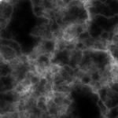
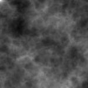
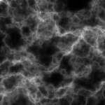
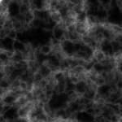
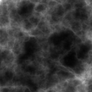
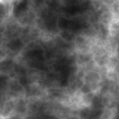
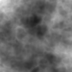
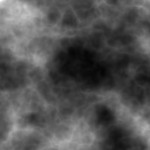

# 3D Noise Generator Dashboard

[](https://github.com/jpvt/NoiseVolumesDemo/blob/main/LICENSE)
[](https://www.linkedin.com/in/jpvt/)











An interactive web-based dashboard for generating and visualizing 3D noise volumes using Streamlit. Customize noise parameters like noise type, volume size, number of volumes, and more, then explore the generated volume slice by slice. Export the volume as a TIFF file for further processing or analysis.

---

## Setup

```sh
pip install -r requirements.txt
```

## Usage

```sh
streamlit run app.py
```

---

## License

MIT License (See [LICENSE](LICENSE) file).

Maintained and developed by [João Pedro Vasconcelos](https://github.com/jpvt) and [Bruno Barufaldi](https://github.com/bbarufaldi).
